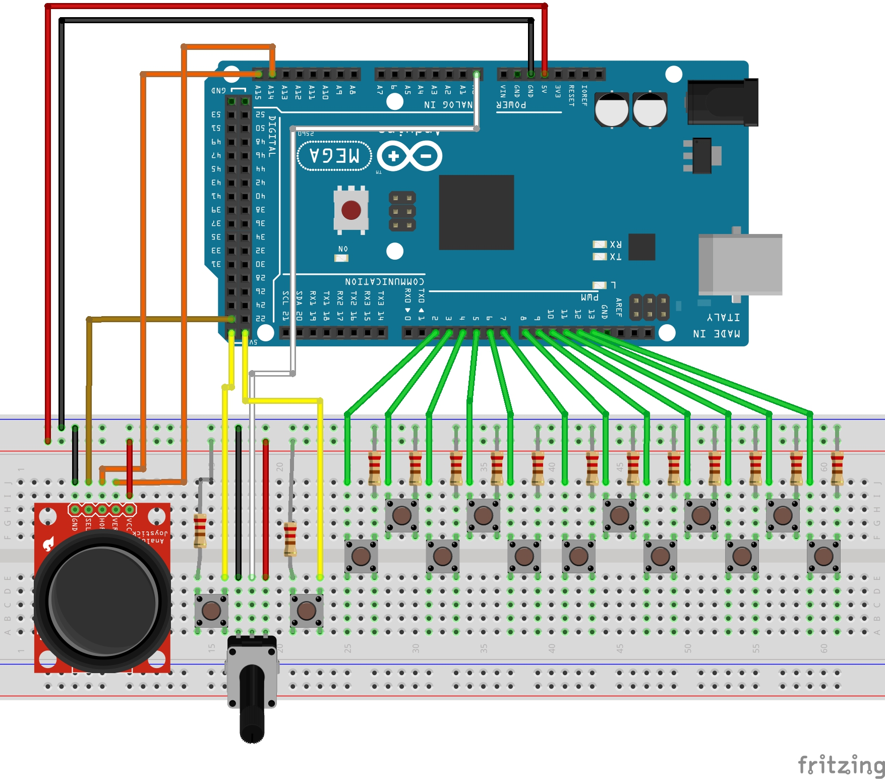

Name: Azeez  Abass  
ID: 1542780  
Name: Matthew Braun  
ID: 1497171  
CMPUT 274 EA1, Fall  2018  

Project: ZMat 2000  

Included Files:
- interface.py
- synthEngine.py
- serialReader.py
- serialWritter.cpp
- schematics.jpg
- Makefile

Interface.py program contains 7 functions and 1 class:
   
    >>>> Functions
    * selectMode
    * selectGraphMode
    * editSourceMode
    * editFilterMode
    * editLFOMode
    * editADSRMode
    * run

    >>>> Classes
    * SynthUI

synthEngine.py module contains 5 functions and 6 classes:
    
    >>>> Functions
    * plt2Img
    * midi
    * Array2PySound
    * playArray
    * noise

    >>>>> Classes
    * SoundController
    * Oscillator
    * Synth
    * Filter
    * Envelope
    * LFO

serialReader.py and serialWritter.cpp are helper files to get input from the Arduino

-- Program Usgae --
---------------

**Arduino**
 
For first time usage, you must configure your Arduino in the configuration shown in the image file: schematics.jpg. Ensure you have all 14 push buttons and resistors, a joystick and a 3 pin potentiometer

 Then run ``make && make upload`` with the arduino plugged in. 

Once its completed, the prgram can now be run. 

**Frontend**

The frontend program for our project is the interface.py program.

In order to use the interface/synthEngine all required modules must be installed:
    * pygame
    * pySerial
    * numpy
    * scipy 
    * matplotlib
These can be installed using ``sudo pip install pygame pySerial numpy scipy matplotlib`` 

usage: run ``python3 interface.py`` in the terminal.

A GUI will appear showing all the Synths than can be edited. 

The joy stick on the arduino is used for navigation to move bewteen modes and synths. 

Use the Joystick select/switch to select the options you which to change. 

The push buttpns to the right of the board are the keyboard buttons and the 2 push buttons on the left are the "more/less or octave up/down" buttons. 

The potentiometer controls the synth volume

-- Notes --
--------------
We were unable to complete interface.py prior to the demo date, So there have been significant changes to it since then. 
